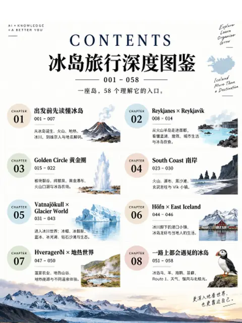
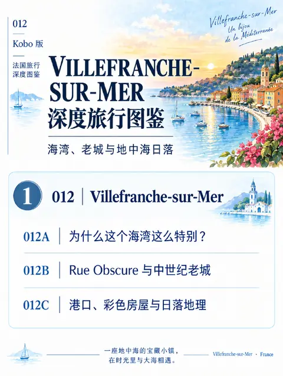
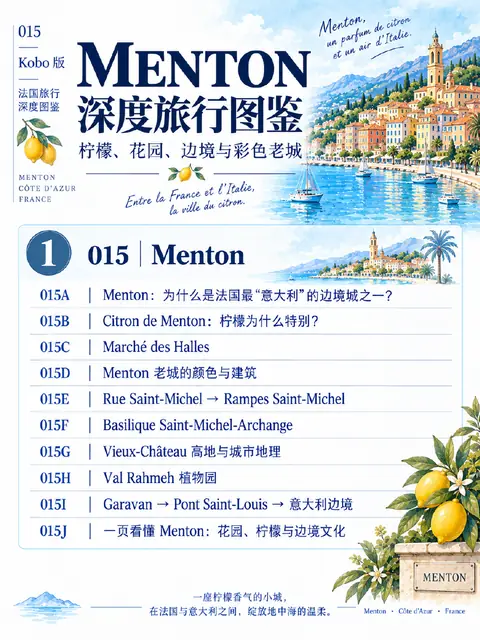
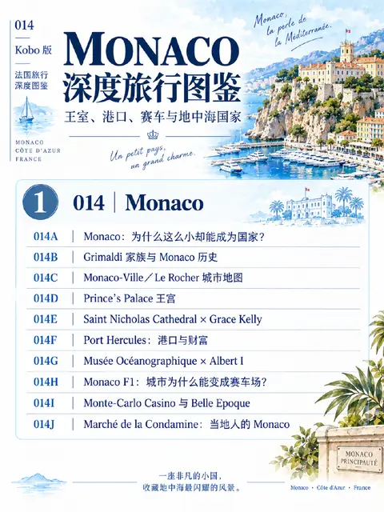
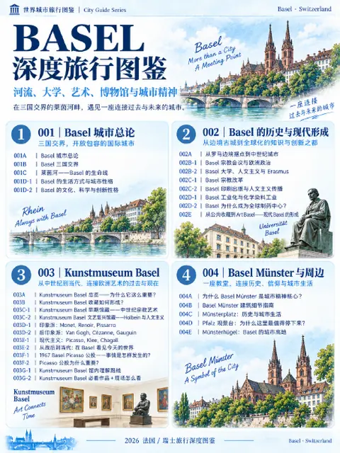

A PRIVATE ENCYCLOPEDIA

# 私人百科图鉴

按领域整理的百科图鉴。每本从一份 Master Index 出发，逐页撰写，慢慢积累。

## 📚 书架

<!-- shelf:start -->

<button class="om-chip is-on" data-filter="all">全部</button><button class="om-chip" data-filter="new">最新上架</button><button class="om-chip" data-filter="身体">身体</button><button class="om-chip" data-filter="自然">自然</button><button class="om-chip" data-filter="北欧旅行百科">北欧旅行百科</button><button class="om-chip" data-filter="法国城市百科">法国城市百科</button><button class="om-chip" data-filter="瑞士城市百科">瑞士城市百科</button><button class="om-chip" data-filter="加拿大城市百科">加拿大城市百科</button>

<a class="om-book__link" href="body/sleep/">

身体
睡眠图鉴
</a>
<a class="om-book__dl" href="https://github.com/littlesharkw/private-encyclopedias/releases/download/pdf-library/sleep.pdf">📥 下载 PDF</a>

<a class="om-book__link" href="nature/flowers/">

自然
花的观察图鉴
</a>
<a class="om-book__dl" href="https://github.com/littlesharkw/private-encyclopedias/releases/download/pdf-library/flowers.pdf">📥 下载 PDF</a>

<a class="om-book__link" href="world/europe/iceland/">

北欧旅行百科
冰岛
</a>
<a class="om-book__dl" href="https://github.com/littlesharkw/private-encyclopedias/releases/download/pdf-library/iceland.pdf">📥 下载 PDF</a>

<a class="om-book__link" href="world/europe/france/provence-alpes-cote-dazur/nice/">

法国城市百科
尼斯 Nice
</a>
<a class="om-book__dl" href="https://github.com/littlesharkw/private-encyclopedias/releases/download/pdf-library/nice.pdf">📥 下载 PDF</a>

<a class="om-book__link" href="world/europe/france/provence-alpes-cote-dazur/villefranche-sur-mer/">

法国城市百科
滨海自由城 Villefranche-sur-Mer
</a>
<a class="om-book__dl" href="https://github.com/littlesharkw/private-encyclopedias/releases/download/pdf-library/villefranche-sur-mer.pdf">📥 下载 PDF</a>

<a class="om-book__link" href="world/europe/france/provence-alpes-cote-dazur/eze/">

法国城市百科
埃兹 Èze
</a>
<a class="om-book__dl" href="https://github.com/littlesharkw/private-encyclopedias/releases/download/pdf-library/eze.pdf">📥 下载 PDF</a>

<a class="om-book__link" href="world/europe/france/provence-alpes-cote-dazur/menton/">

法国城市百科
芒通 Menton
</a>
<a class="om-book__dl" href="https://github.com/littlesharkw/private-encyclopedias/releases/download/pdf-library/menton.pdf">📥 下载 PDF</a>

<a class="om-book__link" href="world/europe/france/provence-alpes-cote-dazur/cassis/">

法国城市百科
卡西斯 Cassis
</a>
<a class="om-book__dl" href="https://github.com/littlesharkw/private-encyclopedias/releases/download/pdf-library/cassis.pdf">📥 下载 PDF</a>

<a class="om-book__link" href="world/europe/france/provence-alpes-cote-dazur/marseille/">

法国城市百科
马赛 Marseille
</a>
<a class="om-book__dl" href="https://github.com/littlesharkw/private-encyclopedias/releases/download/pdf-library/marseille.pdf">📥 下载 PDF</a>

<a class="om-book__link" href="world/europe/france/provence-alpes-cote-dazur/avignon/">

法国城市百科
阿维尼翁 Avignon
</a>
<a class="om-book__dl" href="https://github.com/littlesharkw/private-encyclopedias/releases/download/pdf-library/avignon.pdf">📥 下载 PDF</a>

<a class="om-book__link" href="world/europe/france/provence-alpes-cote-dazur/arles/">

法国城市百科
阿尔勒 Arles
</a>
<a class="om-book__dl" href="https://github.com/littlesharkw/private-encyclopedias/releases/download/pdf-library/arles.pdf">📥 下载 PDF</a>

<a class="om-book__link" href="world/europe/france/auvergne-rhone-alpes/lyon/">

法国城市百科
里昂 Lyon
</a>
<a class="om-book__dl" href="https://github.com/littlesharkw/private-encyclopedias/releases/download/pdf-library/lyon.pdf">📥 下载 PDF</a>

<a class="om-book__link" href="world/europe/monaco/">

法国城市百科
摩纳哥 Monaco
</a>
<a class="om-book__dl" href="https://github.com/littlesharkw/private-encyclopedias/releases/download/pdf-library/monaco.pdf">📥 下载 PDF</a>

<a class="om-book__link" href="world/europe/switzerland/basel/">

瑞士城市百科
巴塞尔 Basel
</a>
<a class="om-book__dl" href="https://github.com/littlesharkw/private-encyclopedias/releases/download/pdf-library/basel.pdf">📥 下载 PDF</a>

<a class="om-book__link" href="world/north-america/canada/ontario/woodstock/">

加拿大城市百科
伍德斯托克 Woodstock
</a>
<a class="om-book__dl" href="https://github.com/littlesharkw/private-encyclopedias/releases/download/pdf-library/woodstock.pdf">📥 下载 PDF</a>

<!-- shelf:end -->

[查看全部 PDF](library.md){ .md-button }

## 按领域浏览

-   **🫀 身体**

    ---

    [睡眠图鉴](body/sleep/index.md)

    119 页 · 11 章 · PDF 可下载

-   **🧠 心灵**

    ---

    [心理学图鉴](mind/psychology/index.md)

    规划中

-   **🌿 自然**

    ---

    [花的观察图鉴](nature/flowers/index.md)

    80 个主题 · 8 部分 · PDF 可下载

-   **✈️ 世界**

    ---

    [深度旅行图鉴](world/index.md)

    洲 › 国家 › 省 › 城市

## 阅读方式

- 用顶部标签页切换领域，在左侧目录选择图鉴
- 每本图鉴建议先看 **Master Index**，再按页码阅读
- 可在右上角搜索关键词，或前往 [标签索引](tags.md) 按主题查找

[浏览标签索引](tags.md){ .md-button } [进入睡眠图鉴](body/sleep/index.md){ .md-button .md-button--primary }

!!! warning "免责声明"
    本系列为个人学习整理，不构成医疗或心理专业意见。如涉及个人情况，请咨询合资格的专业人士。
