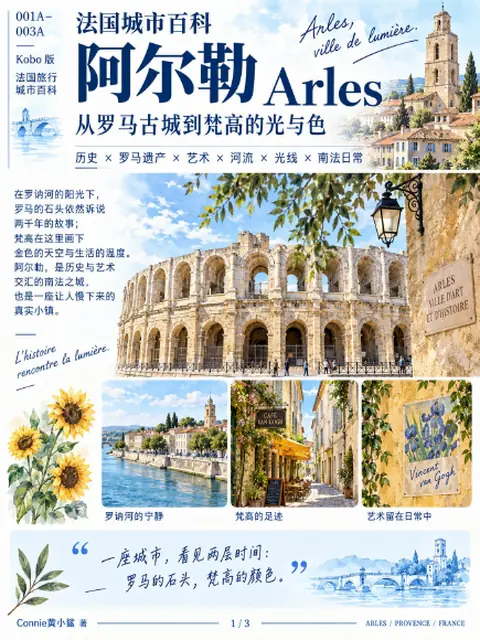

---
tags:
  - 旅行
  - 欧洲
  - 法国城市百科
  - 罗马遗迹
  - 艺术
  - 历史
  - 自然
  - PDF下载
---

# 阿尔勒 Arles

位置：世界 › 欧洲 › 法国 › 普罗旺斯-阿尔卑斯-蓝色海岸大区 › **阿尔勒 Arles**

| 项目 | 内容 |
|---|---|
| 层级 | 城市 |
| 系列 | 法国城市百科 |
| 格式 | PDF |
| 状态 | ✅ 可下载 |

[📥 下载 PDF：法国城市百科 · 阿尔勒 Arles](https://github.com/littlesharkw/private-encyclopedias/releases/download/pdf-library/arles.pdf){ .md-button .md-button--primary }

## PDF 内容简介

阿尔勒是罗讷河畔的罗马古城，也是梵高创作高峰期生活的地方。本册分为「罗马篇」与「梵高的阿尔勒」两部分。目前的 PDF 收录封面与两页目录。

**关键词**：罗马竞技场 Arènes d'Arles、古罗马剧场、共和广场、Saint-Trophime、罗讷河、Camargue 湿地、盐、黑米、梵高 Van Gogh、夜间咖啡馆、黄房子、罗讷河上的星夜、Fondation Vincent van Gogh、Alyscamps、高更

## 收录章节

- 016 Arles 罗马篇：2000 年历史、罗马人为什么选择 Arles、竞技场、古罗马剧场、共和广场、Saint-Trophime、罗讷河、Camargue
- 017 Van Gogh 的 Arles：1888–1889 时间线、作品地点地图、Espace Van Gogh、夜间咖啡馆、黄房子、罗讷河上的星夜、梵高基金会、Alyscamps、阿尔勒的光

!!! info "信息时效"
    交通、价格和开放时间可能会变动，出发前请再次核实。
