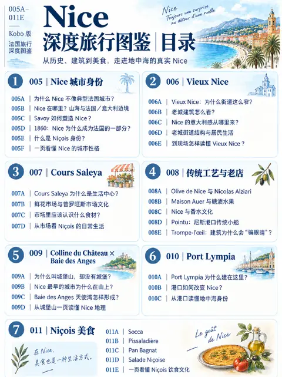

---
tags:
  - 旅行
  - 欧洲
  - 法国城市百科
  - 海景
  - 老城
  - 美食
  - 市集
  - 历史
  - PDF下载
---

# 尼斯 Nice

位置：世界 › 欧洲 › 法国 › 普罗旺斯-阿尔卑斯-蓝色海岸大区 › **尼斯 Nice**

| 项目 | 内容 |
|---|---|
| 层级 | 城市 |
| 系列 | 法国城市百科 |
| 格式 | PDF |
| 状态 | ✅ 可下载 |

[📥 下载 PDF：法国城市百科 · 尼斯 Nice](https://github.com/littlesharkw/private-encyclopedias/releases/download/pdf-library/nice.pdf){ .md-button .md-button--primary }

## PDF 内容简介

尼斯位于山海之间，长期受萨伏依与意大利文化影响，1860 年才并入法国。本册从城市身份讲起，逛老城、花市与老店，登上城堡山读懂天使湾，再到港口与尼斯地道美食。

**关键词**：Vieux Nice、萨伏依 Savoy、1860、Niçois、Cours Saleya 花市、橄榄油 Alziari、Maison Auer 糖渍水果、Pointu 小船、Trompe-l'œil 错视画、城堡山 Colline du Château、天使湾 Baie des Anges、Port Lympia、Socca、Pissaladière、Pan Bagnat、尼斯沙拉

## 收录章节

- 005 Nice 城市身份
- 006 Vieux Nice 老城
- 007 Cours Saleya 市集
- 008 传统工艺与老店
- 009 Colline du Château × Baie des Anges
- 010 Port Lympia 港口
- 011 Niçois 美食

!!! info "信息时效"
    交通、价格和开放时间可能会变动，出发前请再次核实。
